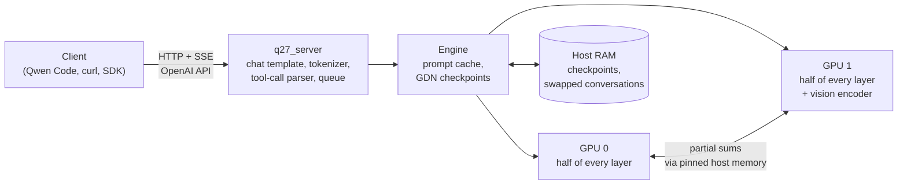

# qwen27-engine

An inference engine written from scratch for one model, **Qwen3.8-27B**, on one kind of machine, **two NVIDIA RTX
5060 Ti 16 GB cards** (Blackwell, sm_120) under Windows (a Linux build is tested under WSL2). It serves an OpenAI-compatible API with streaming, tool
calls, reasoning, image input and speculative decoding. Coding agents such as Qwen Code use it in place of
`llama-server`.

General engines support many models and many GPUs. This one supports one model on one rig, and every kernel is
written for that case. On the same PC it decodes 1.4-1.7x faster than a tuned llama.cpp build (depending on the
context length and the KV cache type), reads prompts 1.7-2.4x faster, and replays a recorded coding-agent session
in half the time. Its output distribution stays as close to llama.cpp's as llama.cpp's own batch mode is to its
one-token mode.

## Contents

- [Performance](#performance)
- [Precision](#precision)
- [How it works](#how-it-works)
- [Requirements](#requirements)
- [Model files](#model-files)
- [Build](#build)
- [Run](#run)
- [API](#api)
- [Tests and benchmarks](#tests-and-benchmarks)
- [Repository layout](#repository-layout)
- [Limits](#limits)
- [License](#license)

## Performance

Same PC, same model file, both servers with 180,224 tokens of context, vision and MTP on, and the same requests
(`bench\compare.py`). llama.cpp is a tuned production build with tensor split (`-sm tensor`), MTP drafting, flash
attention and an f16 KV cache. The engine runs with its defaults, including a q8_0 (int8) KV cache.

| Test | llama.cpp | qwen27-engine | Gain |
|---|---|---|---|
| Decode step at 1k / 30k / 100k / 150k context, ms | 37.1 / 40.4 / 47.6 / 53.3 | 22.5 / 24.3 / 28.6 / 31.9 | 1.65-1.67x |
| Generation at the same depths, tok/s | 76 / 70 / 57 / 52 | 122 / 115 / 99 / 84 | 1.60-1.73x |
| Prompt reading to the same depths, tok/s | 517 / 664 / 534 / 427 | 1245 / 1507 / 1249 / 974 | 2.27-2.41x |
| Resent prompt, time to the first token (1k → 150k) | 181 → 682 ms | 61 → 78 ms | 3.0-8.8x |
| Image 800 x 600 (1,036 tokens), total | 3.75 s | 2.03 s | 1.85x |
| Image 3840 x 2160 (4,099 tokens), total | 12.5 s | 5.2 s | 2.39x |
| Replay of a real Qwen Code session (11 requests) | 93.4 s | 48.6 s | 1.92x |
| VRAM per card at the end | 14.5 + 15.4 GB | 11.5 + 11.9 GB | |
| Load time | 8.3 s | 10.3 s | |

A decode step verifies 3 drafted tokens and emits 2.7-2.8 tokens on average in both engines. Generation in tok/s
depends on how many drafts the model accepts, which varies from run to run (0.57-0.62 here). The time per step
does not, so it is the cleaner measure of speed.

The KV cache types differ. With an f16 cache in both engines, the engine's decode steps are 1.43-1.63x faster
(1.43x at 150k), prompt reading 1.73-2.34x faster, and the agent replay 1.89x faster. The q8_0 cache adds up to 15%
decode speed at 150k context and halves the cache memory.

Methods, the like-for-like table, the time split of a decode step and of a prompt batch, and the measured hardware
limits are in [docs/PERFORMANCE.md](docs/PERFORMANCE.md).

## Precision

The engine runs the same quantized model file as llama.cpp and copies llama.cpp's numerics in its kernels. It
departs from llama.cpp in three places:

- **KV cache in q8_0** (int8 with an fp16 scale per 32 values) instead of f16. `-Kv f16` in the start scripts (or `Q27_KV=f16`)
  switches it back.
- **Sums between the two cards in int8** with error feedback instead of bf16. `Q27_WIRE=bf16` switches it back.
- **Prompt attention computes Q K^T in int8.** K is used exactly as stored in the cache. `Q27_ATTN_I8=0` switches
  it back.

With all three on, the engine's output distribution differs from llama.cpp's (f16 cache) by a mean KL divergence
of 0.0005-0.001, with the same top token at 98.4-99.3% of positions, on prompts up to 131k tokens. llama.cpp's own
batch and one-token modes differ by 0.001 and 98.8%. A retrieval test hides up to 32 facts with look-alike
distractors in prompts of up to 170k tokens: the engine with its q8_0 cache found all of them, as did llama.cpp
with f16. Speculative decoding keeps the output distribution of the full model. [docs/PRECISION.md](docs/PRECISION.md) lists every approximation, the number
formats, the retrieval test, and what was not measured.

## How it works



- **Two cards, one token at a time.** Each card holds half of every layer (tensor parallelism). The cards add
  their partial results twice per layer through pinned host memory, because GeForce cards on Windows have no
  peer-to-peer link. The sums travel as int8 with error feedback, 44% fewer bytes than bf16.
- **Speculative decoding on the GPU.** The model's own MTP head (re-quantized to Q4_K at load, so drafting is
  cheaper) drafts 3 tokens. One 4-token pass verifies them with block verification, an exact rule that accepts at
  least as many drafts as the usual token-by-token rule. Sampling and the acceptance test run on the GPU, and each
  step is one CUDA graph per card. A step emits about 3 tokens.
- **Own kernels for the model's quant types.** Decode GEMVs read the 10 quantization types of the GGUF at 85-90%
  of the memory bandwidth. Prompt GEMMs and prompt attention use int8 tensor cores.
- **Prompt reading in batches of 2048 tokens.** Each batch is split in two halves, so the link traffic of one
  half overlaps the compute of the other.
- **Caches.** A q8_0 KV cache holds the full 262,144-token context. Checkpoints of the recurrent state let a
  conversation restart from earlier points, and conversations that a side request pushes out move to RAM.
- **Vision.** An own encoder on card 1 turns a 4K image into 4,096 tokens in about 1.1 s.

[docs/ARCHITECTURE.md](docs/ARCHITECTURE.md) describes the split over the cards, the decode step, the cross-card
sum, prompt reading, the caches, the numeric choices and all runtime switches. The development history and the
full measurement log are in [PLAN.md](PLAN.md).

## Requirements

- Windows 10/11, x64, or Linux x64 (tested under WSL2 with Ubuntu 24.04; see [Limits](#limits)).
- Two NVIDIA GeForce RTX 50-series cards with 16 GB each (tested: 2x RTX 5060 Ti 16 GB). The code targets sm_120
  (`120a`) and splits the model over exactly two cards.
- An NVIDIA driver for CUDA 13.4, and the **CUDA Toolkit 13.4**. CUDA 13.2 miscompiles IQ3_S on sm_120 (llama.cpp
  PR #27902), so the build refuses anything older than 13.4.
- Windows: Visual Studio 2022 (the free Build Tools are enough) with "Desktop development with C++" and "C++ CMake
  tools for Windows" (CMake 3.28 or newer, Ninja).
- Linux: gcc 13 or newer, CMake 3.28 or newer, Ninja.
- 32 GB of system RAM. The prompt cache keeps up to 8 GB of conversation state in RAM by default.
- Python 3.12, only for the tests and benchmarks.

## Model files

The engine reads one specific GGUF and its vision projector, both from
[ISTA-DASLab on Hugging Face](https://huggingface.co/ISTA-DASLab) (base model:
[Qwen/Qwen3.8-27B](https://huggingface.co/Qwen/Qwen3.8-27B), Apache-2.0):

- `Qwen3.8-27B-GSQ-RCO-IQ3_S-mtp.gguf`: 12.1 GB, mixed 1.75-6.5 bit quantization (IQ1_M to Q6_K), with the MTP
  head.
- `mmproj-Qwen3.8-27B-BF16.gguf`: the vision encoder (optional).

Put them in a `models\` folder in this repository, or point to them with `Q27_MODEL` and `Q27_MMPROJ`. The server
checks the model's architecture, sizes and chat template, and refuses any other file.

## Build

```
git clone https://github.com/avallavall/qwen27-engine
cd qwen27-engine
build.bat
```

`build.bat` finds Visual Studio 2022 and CUDA 13.4 (in `%USERPROFILE%\cuda\v13.4` or the standard install folder).
If they are elsewhere, set `Q27_CUDA` to the CUDA 13.4 folder or `Q27_VCVARS` to `vcvarsall.bat`. The output goes
to `build\`: the server `q27_server.exe`, the tests and the benchmark tools. `build.bat --target q27_server`
builds only the server.

On Linux, with CUDA 13.4 in `/usr/local/cuda-13.4`:

```
./build.sh
```

`Q27_CUDA` points to another CUDA 13.4 folder and `Q27_BUILD_DIR` to another build folder. The output goes to
`build/`, with the same program names (no `.exe`). CMake presets exist for both systems: `cmake --preset
linux-release` (or `win-release` after `tools\env.bat`), then `cmake --build build`.

Under WSL2, install only the CUDA toolkit, never a Linux driver: WSL uses the Windows driver. On 2026-10-07 NVIDIA's
`wsl-ubuntu` apt repository stopped at CUDA 13.3. The `ubuntu2404` repository has 13.4, and since CUDA 13.4 its
`cuda-toolkit-13-4` package no longer pulls a driver. Add an apt pin with priority -1 for `nvidia-*`,
`libnvidia-*` and `cuda-drivers*` to be safe.

## Run

```
powershell -File start-server.ps1 -ApiKey <key>
```

This starts the server on `http://127.0.0.1:8081`, with vision when the mmproj file is found. With an f16 KV cache:

```
powershell -File start-server.ps1 -ApiKey <key> -Kv f16
```

`arranca-q27.ps1` takes the same `-Kv f16`. Without a script, set the environment variable `Q27_KV=f16` before you
start `build\q27_server.exe` (the test tools read it too).

| Option | Default | Meaning |
|---|---|---|
| `-Port` | 8081 | port |
| `-Bind` | 127.0.0.1 | `0.0.0.0` makes the server reachable from the LAN |
| `-ApiKey` | `$env:Q27_API_KEY` | API key (`Authorization: Bearer` or `X-Api-Key`); without a key the server is open |
| `-Ctx` | 0 | context in tokens; 0 = the largest that fits (262,144, the model's maximum, with q8_0 KV) |
| `-Effort` | medium | default reasoning effort: low, medium, xhigh |
| `-Kv` | q8_0 | KV cache type. `-Kv f16` selects an f16 cache: more accurate on paper, 15% slower decode at 150k, about 190k tokens of context at most instead of 262k. Other values are refused. |
| `-Model`, `-Mmproj` | see [Model files](#model-files) | model paths; `-NoVision` for text only |
| `-LogDir` | none | write every request and result as JSON files (for debugging and the checks below) |

`arranca-q27.ps1` replaces a `llama-server` on port 8080: it listens on all interfaces, reads the API key that
Qwen Code sends from `~\.qwen\.env` (`QWEN_LOCAL_API_KEY`), asks before it stops a running `llama-server`, and
checks that the new server answers.

On Linux, `./start-server.sh --api-key <key>` does the same. It takes the same options in lower case (`--port`,
`--bind`, `--ctx`, `--effort`, `--kv f16`, `--model`, `--mmproj`, `--no-vision`, `--log-dir`). Options after `--`
go to `q27_server` unchanged, for example `-- --cache-ram 4096`.

`build\q27_server.exe --help` lists the server options: `--temp`, `--top-p`, `--top-k`, `--min-p`,
`--chat-template-kwargs JSON`, `--cache-ram MB`, `--image-min-tokens` (default 1024), `--image-max-tokens` (4096),
`--draft-vocab N|file[:N]|0` and `--alias`.

## API

OpenAI-compatible, with llama.cpp's response shapes (`reasoning_content`, `timings`, a usage chunk):

- `POST /v1/chat/completions` (also `/chat/completions`), streaming or not
- `GET /health`, `/v1/health` (no key needed), `/props`, `/v1/models`, `/models`
- `POST /tokenize`, `/detokenize`, `/apply-template`

```
curl http://127.0.0.1:8081/v1/chat/completions -H "Authorization: Bearer <key>" -H "Content-Type: application/json" ^
  -d "{\"messages\":[{\"role\":\"user\",\"content\":\"Say OK.\"}],\"stream\":true}"
```

A request can use:

- `messages` with the `system`/`developer`, `user`, `assistant` (with `reasoning_content` and `tool_calls`) and
  `tool` roles; text parts and `image_url` parts (`data:image/...;base64,...` URIs: PNG, JPEG, BMP, GIF and others).
- `tools` (function tools). The model's XML tool calls become OpenAI `tool_calls` deltas while streaming, with the
  same results as llama.cpp's parser.
- `max_tokens` (or `max_completion_tokens`), `temperature`, `top_p`, `top_k` (at most 20), `min_p`, `seed`, `stop`.
  Defaults: temperature 1.0, top-p 0.95, top-k 20, min-p 0 (the model's recommended settings).
- `reasoning_effort` (top level, in `chat_template_kwargs`, or as `reasoning: {effort}`): `low`, `medium` or
  `xhigh`. `high` and `max` map to `xhigh`, `minimal` to `low`, and `none` or `off` turn thinking off.
  `chat_template_kwargs.enable_thinking: false` also turns it off.

A context overflow returns HTTP 400 with both llama.cpp's and OpenAI's wording, so clients that compact on either
message keep working.

### Qwen Code

Point a provider in `~\.qwen\settings.json` at the server (`"baseUrl": "http://127.0.0.1:8081/v1"`, with the key
in the variable named by `envKey`). To let Qwen Code choose the reasoning effort, add to that provider:

```json
"capabilities": { "reasoning": { "profile": "openai-effort", "efforts": ["low", "medium", "high", "xhigh"],
                                 "defaultEffort": "medium" } }
```

## Tests and benchmarks

| What | Command |
|---|---|
| Logits vs llama.cpp, decode path | `build\q27_ppl.exe <model> <llama-perplexity base> <out> 0,1 8 4`, then `llama-perplexity --kl-divergence` on `<out>` |
| Logits vs llama.cpp, long prompts | `build\q27_ppl.exe <model> <reference> - 0,1 1 P` (references from `bench\llama_ref.exe`) |
| Tokenizer vs llama.cpp | `build\test_tokenizer.exe <model.gguf>` (needs a golden file, see the header of `tools\test_tokenizer.cpp`) |
| Chat template vs jinja2 | `python tools\gen_template_fixtures.py`, then `build\test_template.exe bench\out\template_fixtures.json` |
| Tool-call parser | `build\test_parser.exe <model.gguf>` |
| Cross-card sum, fused kernels | `build\test_ar.exe`, `build\test_fused.exe` |
| Prompt cache (GPU) | `build\test_cache.exe <model.gguf> <token file>` |
| Vision encoder vs llama.cpp | `build\test_vision.exe <mmproj.gguf> compare bench\out\vision` (reference: `bench\build-llama-vision.bat`) |
| Server, end to end | start the server with a key, then `python bench\test_server.py` (`BENCH_KEY`, `BENCH_URL`) |
| Image answers | `python bench\vision_answers.py` |
| Prompts and tool calls vs llama.cpp | `bench\build\llama_chat.exe <server log dir>` (`bench\build-llama-chat.bat`) |
| Real Qwen Code session | `python bench\qwen_session.py --yolo` (Qwen Code then approves every tool call by itself: any command, any file) |
| Speed | `build\q27_gen.exe <model> <token file> 0,1 1000,30000,100000,150000 400 depth 2`, `python bench\mide-tps.py`, `python bench\compare.py` |
| Speed, A/B of settings | `python bench\ab.py 2 "a=Q27_X=0" "b=Q27_X=1"` |
| Time per kernel group | `set Q27_PROF=1`, then `build\q27_gen.exe ... sample` |

On Linux the tools have the same names in `build/`. The commands above are the Windows form.

The Python scripts use a virtual environment with `jinja2`, `numpy`, `pillow` and `gguf`. The comparisons with
llama.cpp link a llama.cpp build (`Q27_LLAMA_BIN`) and its source headers (`Q27_LLAMA_SRC`); see `tools\env.bat`.

## Repository layout

| Path | Contents |
|---|---|
| `src\` | the engine: GGUF reader, kernels (`qgemv`, `qgemm`, `attn`, `ops`, `prefill`, `vision`), model and decoder, sampling, tokenizer, chat template, stream parser, server engine |
| `tools\` | `q27_server.cpp`, tests, benchmark tools, `env.bat` |
| `bench\` | benchmark and check scripts, llama.cpp reference tools |
| `data\` | `draft_vocab.bin` (token ranking for the MTP drafts, made by `bench\make_draft_vocab.py`) |
| `docs\` | [ARCHITECTURE.md](docs/ARCHITECTURE.md), [PERFORMANCE.md](docs/PERFORMANCE.md), [PRECISION.md](docs/PRECISION.md) |
| `research\` | design research written before the code, with sources |
| `PLAN.md` | development plan, milestone status and the full measurement log |
| `third_party\` | cpp-httplib, nlohmann/json, stb_image |

## Limits

- One model file.
- Linux is tested only under WSL2 (Ubuntu 24.04, 2026-10-07). All tests pass there, and the logits are the same as on
  Windows. WSL runs on the Windows driver, so its speed is not a Linux number. A native Linux install is not tested.
- Exactly two cards. The split over the cards is fixed.
- One request computes at a time; others wait in a queue.
- No logprobs, grammars, JSON schema output or repetition penalties. `top_k` is at most 20.
- A trailing assistant message starts a new turn. The engine does not continue it.
- Images: `data:` URIs only (no remote URLs), no WebP.

## License

MIT, see [LICENSE](LICENSE). Parts are derived from [llama.cpp / ggml](https://github.com/ggml-org/llama.cpp) (MIT).
[THIRD_PARTY_NOTICES.md](THIRD_PARTY_NOTICES.md) lists them and the vendored libraries. The model weights are not
part of this repository and have their own license.
