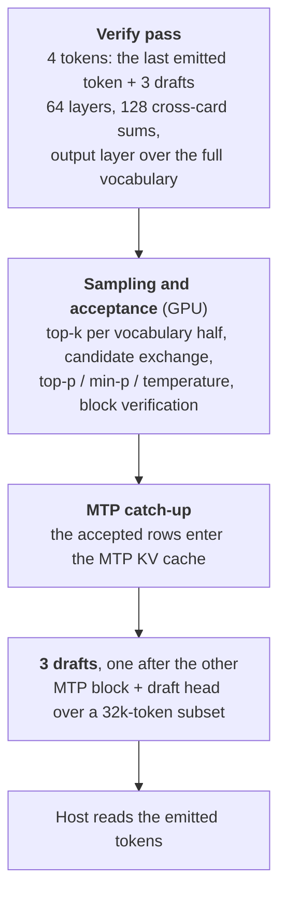
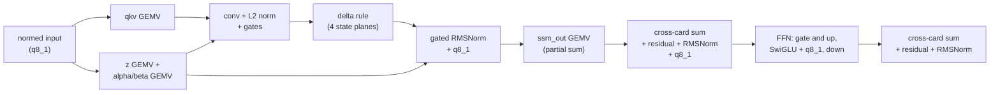
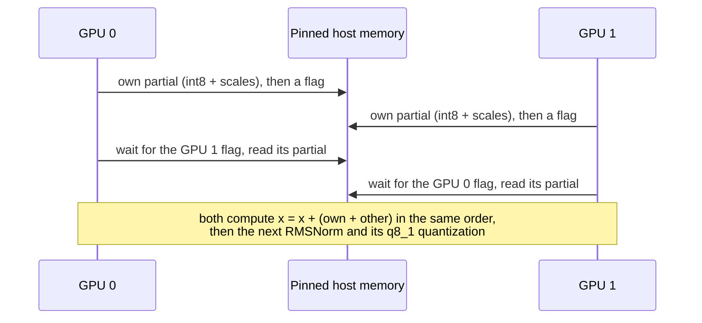

# Architecture

This document describes how qwen27-engine runs Qwen3.8-27B on two RTX 5060 Ti cards. It covers the model, the
split over the cards, the decode step, prompt reading, the caches, vision, the server and the numeric choices.
Measured speed is in [PERFORMANCE.md](PERFORMANCE.md), and the precision of every approximation in
[PRECISION.md](PRECISION.md).

## Contents

- [Model](#model)
- [Hardware constraints](#hardware-constraints)
- [Split over the two cards](#split-over-the-two-cards)
- [Decode step](#decode-step)
- [Cross-card sum](#cross-card-sum)
- [Kernels](#kernels)
- [Prompt reading](#prompt-reading)
- [KV cache and prompt cache](#kv-cache-and-prompt-cache)
- [Vision](#vision)
- [Server](#server)
- [Numerics](#numerics)
- [Memory per card](#memory-per-card)
- [Runtime switches](#runtime-switches)

## Model

Qwen3.8-27B is a hybrid model. Three of every four layers use Gated DeltaNet (GDN), a linear-attention layer with a
fixed-size recurrent state. Every fourth layer uses full attention with a KV cache. An extra multi-token prediction
(MTP) block predicts the next tokens for speculative decoding.

| Property | Value |
|---|---|
| Layers | 64: 48 Gated DeltaNet, 16 full attention (layers 3, 7, ..., 63) |
| Hidden size, FFN size | 5120, 17408 |
| Full attention | 24 query heads, 4 KV heads, head size 256, sigmoid output gate, RoPE on 64 dims (IMRoPE for images) |
| Gated DeltaNet | 16 key heads, 48 value heads, head size 128, causal convolution of width 4, f32 state of 128 x 128 per value head |
| MTP block | one attention layer + FFN (`blk.64`, Q6_K in the file; the engine re-quantizes it to Q4_K at load), input projection from 2 x 5120 to 5120 |
| Vocabulary | 248,320 tokens |
| Trained context | 262,144 tokens |
| Weights file | `Qwen3.8-27B-GSQ-RCO-IQ3_S-mtp.gguf`, 12.1 GB, 10 quantization types (IQ1_M to Q6_K), BF16 for the small GDN alpha/beta projections |

## Hardware constraints

The design follows from four facts about the target machine:

1. **Decode is limited by memory bandwidth.** Each card reads about 430-450 GB/s. One verify pass reads about
   5.7 GB of weights per card, so the floor is about 13 ms per pass.
2. **The cards cannot talk directly.** GeForce cards on Windows have no peer-to-peer access. All traffic between
   the cards goes through pinned host memory. On the test rig each card has a PCIe 3.0 x4 link. It carries about
   3 GB/s per card, and reads and writes share that budget.
3. **Windows (WDDM) adds launch cost.** A kernel launch outside a CUDA graph costs about 7 µs. Inside a graph it
   costs about 1.5 µs. Each card has one copy engine.
4. **Card 0 drives the desktop.** It keeps about 1-2 GB free for the desktop.

## Split over the two cards

Both cards work on every token. Each card holds half of every layer (tensor parallelism). After the layers that
produce partial sums, the two cards add their partials (the cross-card sum below). There are two sums per layer,
128 per pass.

| Part | Card 0 | Card 1 | Kind of split |
|---|---|---|---|
| GDN | key heads 0-7 and the 24 value heads that read them (0-7, 16-23, 32-39) | key heads 8-15 and value heads 8-15, 24-31, 40-47 | heads (column split); `ssm_out` row split |
| Attention | KV heads 0-1 with their 12 query heads | KV heads 2-3 with their 12 query heads | heads; `attn_output` row split |
| FFN | rows 0-8703 of gate and up | rows 8704-17407 | rows; `ffn_down` row split |
| Output layer | vocabulary 0-124,159 | vocabulary 124,160-248,319 | vocabulary |
| MTP block | half, like an attention layer | half | heads and rows; input projection on both cards |
| Draft head | half of the 32k draft subset | other half | rows |
| Token embedding | a copy of the IQ2_S table (407 MB) | the same copy | each card reads its own rows |
| Vision encoder | | whole encoder | card 1 only (card 0 has the desktop) |

Each card keeps the same residual stream. After every sum both cards hold the same values, bit for bit.

## Decode step

Decoding uses the model's MTP head for speculative decoding. One step verifies three draft tokens and drafts the
next three. A step emits 1 to 4 tokens, about 3 on average.



- **One CUDA graph per step and card.** The whole step, including sampling and the acceptance test, runs on the
  GPU. The host launches the graph, waits, and reads 1-4 tokens.
- **Acceptance.** Block verification (Sun et al., "Block Verification Accelerates Speculative Decoding", ICLR 2025):
  the three drafts are judged together. A weight P_i = min(P_{i-1} p_i/q_i, 1) follows the chain, and the longest
  prefix passes with a probability derived from the residual mass max(P_i p - q, 0) of the next position. The next
  token comes from that residual, or from the target after a fully accepted chain. The output distribution is the
  same as plain sampling, and the expected number of tokens per step is never lower than with llama.cpp's
  token-by-token rule (`common/sampling.cpp`: keep a draft with probability min(1, p/q), else draw from
  max(0, p - q)). `Q27_ACCEPT=token` selects llama.cpp's rule. `build\test_accept.exe` checks both rules on
  synthetic distributions: the frequency of every emitted sequence must match the target (chi-square), and a
  deliberately wrong rule must fail. Code is in `src/accept.cuh`.
- **MTP layer in Q4_K.** The file stores the MTP block in Q6_K. Only the drafts read it, four times per step, so the
  engine re-quantizes it to Q4_K at load (`src/requant.cpp`, ported from llama.cpp's reference quantizers; it runs
  on a CPU thread while the cards load the main layers). A smaller drafter changes which tokens get proposed, never
  the output distribution. It saves 0.6 ms per step and costs 0.3-1.1% of the accepted drafts.
- **GDN rollback.** The recurrent state cannot be cut back. The verify pass therefore keeps the state after each of
  its 4 tokens (4 state planes). The next pass starts from the plane of the last accepted token.
- **Draft vocabulary.** The drafts score only the 32,768 tokens that a frequency ranking (`data\draft_vocab.bin`)
  marks as most useful. The verify pass still scores all 248,320 tokens, so the output distribution does not
  change. The draft rows are split evenly over the two cards.
- **Parallel graph branches.** GEMVs in a layer that read the same input run on two branches of the graph: the
  attention K and V projections next to Q, the FFN up projection next to gate, and the GDN z and alpha/beta
  projections next to qkv. One GEMV can start while the other finishes.

A GDN layer on one card, for the 4 tokens of a verify pass:



## Cross-card sum

Each sum adds two partial vectors of 4 x 5120 values (one per card) and gives both cards the same result. The
traffic goes through mapped pinned host memory.



- **One kernel per sum.** The kernel writes its partial, raises a per-row flag, spins on the peer's flag, reads
  the peer's partial, adds both to the residual, and applies the next RMSNorm and q8_1 quantization. Flags carry a
  step counter, so no reset is needed between steps.
- **Wire format.** A partial travels as int8 values with one fp16 scale per 16 values: 56% of the bytes of bf16.
  Each card adds the rounding error of its previous sum to its next partial (error feedback). The error in the
  residual stream then stays at the size of one rounding and does not grow over the 128 sums. The logit tests show
  the same accuracy as a bf16 wire ([PRECISION.md](PRECISION.md#cross-card-sums)). Copies go through shared memory
  so the link sees 16-byte accesses.
- **Why bytes matter.** The link carries about 3 GB/s per card for reads and writes together. At 4 tokens a sum
  sends 23 KB and receives 23 KB per card. Fewer bytes are the only way to make it shorter.
- **Prefetch.** While the row blocks wait for the peer, 4 extra blocks of the same kernel prefetch the first 4 MB of
  the next GEMV's weights into L2 (`cp.async.bulk.prefetch.L2`) and exit. When the row blocks issued the prefetch
  themselves, the issue held each block about 10 µs at its next barrier and delayed the flag to the other card.
- **Phases.** `Q27_SUMPROF=1` times each phase inside the kernel. At 4 rows on the slower card: write own partial
  9.4 µs, flag and wait 2 µs, read the peer's partial 8 µs. The link moves about 46 KB per sum at about 2.7 GB/s.

## Kernels

| Kernel | File | Method |
|---|---|---|
| Decode GEMV | `src/qgemv.cu` | Weights repacked at load time into a tile layout: 8 rows by 32-weight sub-blocks, each field of the quant block in its own array, so a warp reads 128-bit words. Persistent CTAs of 4 warps. Rows split into segments only when the tiles cannot fill the GPU; the last segment adds the partials in a fixed order. 1, 2 or 4 columns. llama.cpp's integer dot products on q8_1 activations. |
| Prompt GEMM | `src/qgemm.cu` | int8 tensor cores (`mma.sync m16n8k32`) with llama.cpp MMQ numerics: weights unpacked to exact int8 with a scale per 32 or 16, activations q8_1, scales applied in f32. 128 x 128 tiles with 16 warps (128 x 64 for Q6_K, Q4_K and small batches). Weight loads for the next K block are issued before the tensor-core work on the current one. CTAs that share a weight tile run at the same time, so the weights come from DRAM once. |
| Attention, decode | `src/attn.cu` | Split-KV over position chunks. One CTA reads each K/V row once for all 6 query heads and all 4 tokens. f16 tensor cores; q8_0 rows converted to f16 in shared memory. The sigmoid gate is applied in the combine kernel. |
| Attention, prompt | `src/attn.cu` | Causal flash attention, 16 query tokens x 6 heads per CTA. Q K^T on int8 tensor cores: Q is rounded to int8 with a scale per 32 dimensions, K is the int8 data of the q8_0 cache. P V in f16 with llama.cpp's offset. 16 positions per tile; long ranges are split over several CTAs and merged. |
| Gated DeltaNet | `src/ops.cu`, `src/prefill.cu` | Decode: one warp per value column, state in registers, 4 snapshot planes. Prompt: q, k, v of 32 tokens staged in shared memory, 8 threads per state column. Fused conv + L2 norm + gates and fused gated RMSNorm + q8_1. |
| Sampling | `src/sampling.cu` | Top-k per vocabulary half with sorted per-warp lists and bitonic merges. The two cards exchange their top 20 through host memory and apply the same chain as llama.cpp: top-k, top-p, min-p, temperature (drafts: top-k 10, temperature). Random numbers come from a counter-based hash, so both cards draw the same values without talking. |
| Vision | `src/vision.cu` | BF16 tensor-core GEMMs with fused epilogues (QKV + 2D RoPE, bias + GELU, bias + residual), flash attention for head size 72, patch merger. |

Small element-wise steps are fused into the neighbouring kernels. Every RMSNorm writes the q8_1 input of the next
GEMV directly.

## Prompt reading

Prompts are read in batches of up to 2048 tokens. Each batch is split into two halves A and B. While one half
computes, the copy engine exchanges the other half's partial sums.

```
compute stream:  A(p) | B(p) | sum A(p), A(p+1) | sum B(p), B(p+1) | sum A(p+1), A(p+2) | ...
copy engine:            A(p): out, flag, wait, in | B(p): out, flag, wait, in | A(p+1) ...
```

- Part p is one block (GDN or attention) or one FFN, ending with a row-split GEMM.
- The copy stream sends the int8 partial to pinned host memory, writes a flag with `cuStreamWriteValue32`, waits
  for the peer's flag with `cuStreamWaitValue32`, and copies the peer's partial back. No SM time is spent on the
  wait.
- GDN: half A writes its final state to the other plane and half B continues from there.
- The MTP block also runs over the batch rows, so its KV cache is complete when generation starts.
- Kernels in prompt reading are launched one by one (no graph). The GPU stays ahead of the host because each
  batch is large.

## KV cache and prompt cache

- **KV cache.** q8_0 by default: int8 values and an fp16 scale per 32 values, layout `[kv head][position][256]`.
  It costs 18 KiB per token per card (34 KiB with `Q27_KV=f16`). At startup the server sizes the context from the
  free VRAM, up to the trained 262,144 tokens.
- **Prefix reuse.** A request reuses the longest common prefix with the live conversation.
- **Checkpoints.** The GDN state cannot be cut back, so the engine copies it (75 MB per card) to pinned RAM at
  fixed points: after the first turn, at the start of the last message, 512 tokens before the end of a long last
  message, at the start of the generation prompt, and every 16,384 tokens (at most 8 per conversation). A request
  that edits an earlier message restarts from the nearest checkpoint. A request that changes only the end of a long
  last message (a regenerate, or a new question about the same document) re-reads about 600 tokens. The last saved
  checkpoint also stays in a VRAM staging buffer; when a request restarts from it (the usual case in an agent
  loop), the restore takes 1.6 ms instead of 23 ms.
- **RAM swap.** When a side request replaces most of the live conversation, the conversation (KV rows, state and
  checkpoints) is first copied to RAM (0.2-0.5 s for 16k tokens). A later request loads it back in 0.1-0.2 s.
  The RAM budget is `--cache-ram` (8192 MB by default).

## Vision

The encoder runs on card 1 after the decoder has taken its memory. Images are decoded with stb_image and resized
like llama.cpp (smart resize, Pillow-style bicubic), so the input tensor is bit-identical. The encoder has 27 ViT
blocks and a 2 x 2 patch merger. A 3840 x 2160 image (4,096 image tokens) takes about 1.1 s. Image rows enter the
decoder as embedding rows with IMRoPE positions (time, height, width). Text after an image continues from the
image's position, as in llama.cpp. Image rows also pass through the MTP block.

## Server

`tools/q27_server.cpp` (HTTP glue) and `src/engine.*` (queue and prompt cache):

- cpp-httplib with SSE streaming, keep-alive pings every 10 s, and early stop when the client disconnects.
- The model's chat template is hard-coded in C++ and checked byte for byte against jinja2 on 576 fixtures. The
  server refuses a GGUF whose template hash differs.
- The tokenizer is a port of llama.cpp's BPE with the `qwen35` pre-tokenizer. It gives the same ids as llama.cpp
  on 41 million tokens.
- The XML tool-call format of the model is parsed while streaming. It matches llama.cpp's parser on 33,988 of 34,000
  random outputs; the remaining 12 are a llama.cpp bug at end of stream.
- One compute slot with a FIFO queue. Responses use llama.cpp's shapes (`reasoning_content`, `timings`, a usage
  chunk).

## Numerics

The reference is llama.cpp with the same GGUF. Kernels copy llama.cpp's numerics where they decide the result:
q8_1 activations with fp16 scales, the integer truncations of the IQ dot products, and Q and P rounded to f16 in
decode attention. The logit tests compare the full output distribution of both engines on the same tokens (mean KL
divergence and same top token).

Three choices depart from llama.cpp on purpose. Each one measured as accurate as the llama.cpp-style path or
better. [PRECISION.md](PRECISION.md) gives the measurements and lists all other approximations.

| Choice | Default | Reason | Switch back |
|---|---|---|---|
| q8_0 KV cache | on | half the KV memory, 262k context, faster long decode | `Q27_KV=f16` |
| int8 wire with error feedback for the cross-card sums | on | 44% fewer bytes on the link | `Q27_WIRE=bf16` |
| int8 Q K^T in prompt attention | on | 2x faster attention; K keeps the exact cache values | `Q27_ATTN_I8=0` |

Results stay deterministic. Every split of a sum (GEMV segments, attention chunks) is added in a fixed order.

## Memory per card

With the server defaults (q8_0 KV, prompt batches of 2048, vision on):

| Item | Card 0 | Card 1 |
|---|---|---|
| Weights (half of each layer, MTP, draft head, token embedding) | about 6.2 GB | about 6.2 GB |
| KV cache, 262,144 tokens | 4.5 GB | 4.5 GB |
| GDN state, 4 planes | 0.3 GB | 0.3 GB |
| Prompt buffers (2048-token batch) | about 0.7 GB | about 0.7 GB |
| Vision encoder and image buffers | | about 1.2 GB |
| Measured total after a 150k prompt and 4K images (second round; the embedding copy adds 0.4 GB per card) | 12.9 GB | 13.4 GB |

## Runtime switches

Environment variables read by the engine. The defaults are the measured best settings; the other values exist
for tests and comparisons.

| Variable | Default | Effect |
|---|---|---|
| `Q27_KV` | q8_0 | `f16` selects an f16 KV cache |
| `Q27_WIRE` | `q8b16` | wire of the cross-card sums: `q8b16`, `q8` (scale per 32), `bf16` |
| `Q27_EF` | on | `0` turns off the error feedback of the int8 wire |
| `Q27_ATTN_I8` | on | `0` selects the f16 Q K^T path in prompt attention |
| `Q27_ATTN_PT`, `Q27_ATTN_SPLIT` | 16, auto | positions per tile and forced split count of the int8 prompt attention |
| `Q27_PREFILL_BATCH` | 2048 | prompt batch size in tokens |
| `Q27_PF_OVERLAP` | on | `0` selects prompt reading without the copy-engine overlap |
| `Q27_BRANCH` | on | `0` runs all GEMVs of a layer in one stream |
| `Q27_PF_MB` | 4 (8 with the bf16 wire) | L2 prefetch budget per cross-card sum, in MB |
| `Q27_PF_MID` | off | `1` also prefetches in the GDN conv and attention prep kernels |
| `Q27_PDL`, `Q27_PDL_SUM` | off | programmatic dependent launch for all kernels / for the GEMV after a sum |
| `Q27_GEMM_CFG` | auto | prompt GEMM tile: 0 = 128 x 64, 4 = 128 x 128 with 16 warps (see `src/qgemm.cu`) |
| `Q27_PF_BLOCKS`, `Q27_PF_INROW` | 4, off | extra blocks that issue the L2 prefetch of a cross-card sum; `Q27_PF_INROW=1` issues it from the row blocks (old) |
| `Q27_MTP_TYPE` | `q4_k` | type of the MTP block: `q4_k`, `iq4_xs`, or `q6_k` (as in the file) |
| `Q27_ACCEPT` | block | `token` selects llama.cpp's token-by-token acceptance rule |
| `Q27_EMBD_HOST` | off | `1` keeps one token embedding table in mapped host memory instead of a copy per card |
| `Q27_STAGE_HIT` | on | `0` always restores checkpoints from host memory |
| `Q27_DRAFT_VOCAB` | none | tools only: draft vocabulary file and size, e.g. `data\draft_vocab.bin:32768` (the server uses `--draft-vocab`) |
| `Q27_PROF` | off | `1` adds GPU time stamps; `q27_gen` prints the time per kernel group |
| `Q27_SUMPROF`, `Q27_GAPPROF` | off | `1` prints the phase times of the cross-card sums / the host time per decode step when the decoder ends |
| `Q27_DRAFTLOG` | none | `q27_gen ... accept` only: writes the drafts' probabilities and the tokens emitted per step to a file |
| `Q27_UNFUSED`, `Q27_GDN_OLD`, `Q27_BF16_OLD` | off | older kernel paths, for bit-exactness tests |
